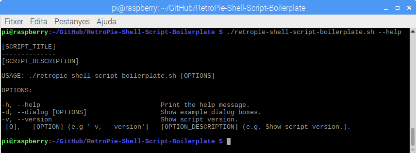
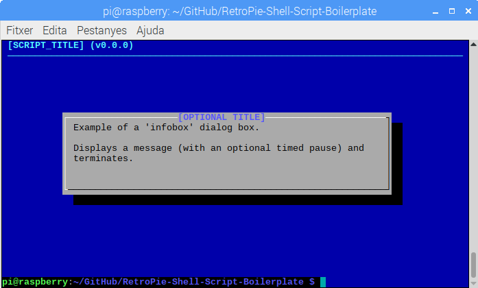
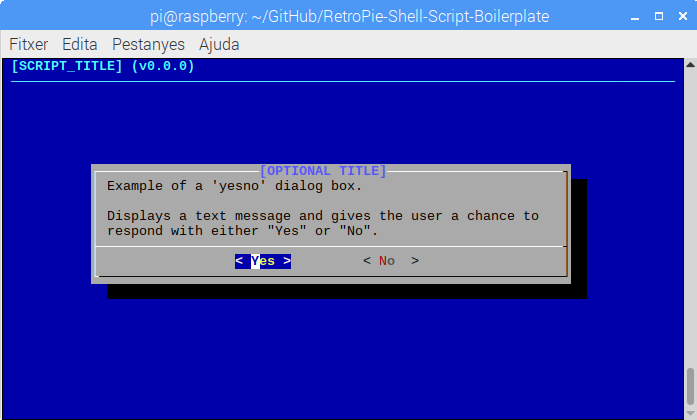
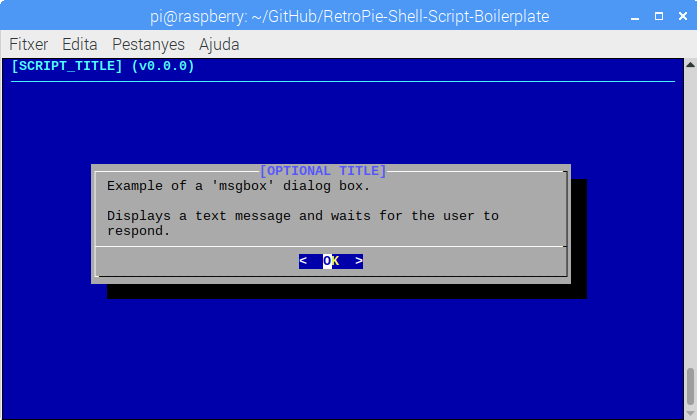
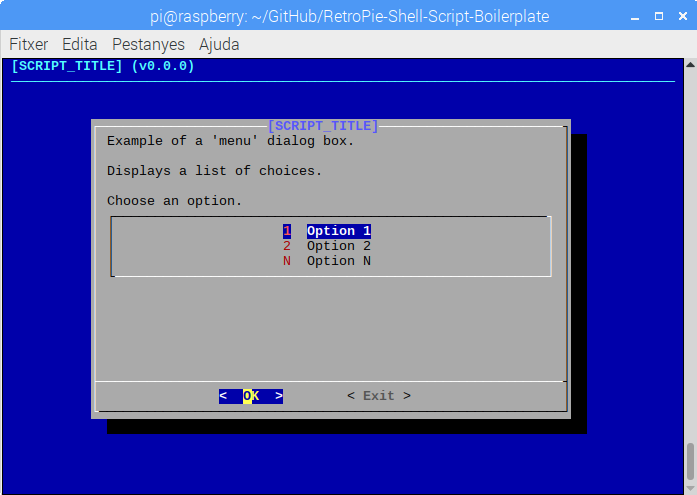

# [SCRIPT_TITLE] (e.g. "RetroPie Shell Script Boilerplate")

[SCRIPT_DESCRIPTION] (e.g. "A template for building shell scripts for RetroPie.")

## Installation

```bash
cd /home/pi/
git clone [REPO_URL] (e.g. "https://github.com/hiulit/RetroPie-Shell-Script-Boilerplate")
cd [REPO_NAME]/ (e.g "RetroPie-Shell-Script-Boilerplate")
sudo chmod +x [SCRIPT_NAME].sh (e.g. "retropie-shell-script-boilerplate")
```

## Update

```bash
cd /home/pi/[REPO_NAME]/ (e.g "RetroPie-Shell-Script-Boilerplate")
git pull
```

## Usage

**COMMENTS:**
- **Add `sudo` before `./[SCRIPT_NAME].sh` if the script needs to be run under sudo.**
- **Don't change `[OPTIONS]`!**
- **Remember to remove these comments.**

```bash
./[SCRIPT_NAME].sh [OPTIONS] (e.g. "retropie-shell-script-boilerplate)"" 
```

If no options are passed, you will be prompted with a usage example:

```bash
USAGE: ./[SCRIPT_NAME].sh [OPTIONS] (e.g. "retropie-shell-script-boilerplate")

Use '--help' to see all the options.
```

## Options

**COMMENTS:**
- **Add as many `--[OPTION]: [OPTION_DESCRIPTION]` as you need.**
- **Remember to remove these comments.**

* `--help`: Print the help message.
* `--dialog [OPTIONS]`: Show example dialog boxes.
* `--version`: Show script version.
* `--[OPTION]`: [OPTION_DESCRIPTION] (e.g "`--version`: Show script version.")

## Examples

### `--help`

Print the help message.



#### Example

**COMMENTS:**
- **Add `sudo` before `./[SCRIPT_NAME].sh` if the script needs to be run under sudo.**
- **Remember to remove these comments.**

`./[SCRIPT_NAME].sh --help (e.g. "retropie-shell-script-boilerplate")`

### `--dialog [OPTIONS]`

Show example dialog boxes.

Take a look at [utils/dialog.sh](utils/dialogs.sh) for more documentation on how to use dialogs.

#### Options

* `infobox` - Show an example of an "Info Box".

* `yesno` - Show an example of a "Yes/No Box".

* `msgbox` - Show an example of a "Message Box".

* `menu` - Show an example of a "Menu Box".


#### Example

`./retropie-shell-script-boilerplate --dialog "yesno"`

### `--version`

Show script version.

#### Example

**COMMENTS:**
- **Add `sudo` before `./[SCRIPT_NAME].sh` if the script needs to be run under sudo.**
- **Remember to remove these comments.**

`./[SCRIPT_NAME].sh --version (e.g. "retropie-shell-script-boilerplate")`

### `--[OPTION]`

[OPTION_DESCRIPTION]

#### Example

**COMMENTS:**
- **Add `sudo` before `./[SCRIPT_NAME].sh` if the script needs to be run under sudo.**
- **Remember to remove these comments.**

`./[SCRIPT_NAME].sh --[OPTION] (e.g. "retropie-shell-script-boilerplate --version")`

## Config file

[CONFIG_FILE_DESCRIPTION]

**COMMENTS:**
- **Copy and paste your config file.**
- **If the config file is too big, maybe it's not a good idea to add it here.**
- **Remember to remove these comments.**

```
# Settings for [SCRIPT_TITLE] (e.g. "RetroPie Shell Script Boilerplate")

# Add your own [key = "value"] (e.g. path_to_whatever = "/path/to/whatever")
# [KEY] WITHOUT quotes.
# [VALUE] WITH quotes.
# There MUST be 1 space before and after '='.
# To indicate that a [KEY] has NO [VALUE] or is NOT SET, just leave the quotes, like this: "".

# Description of the [key = "value"] (e.g. # Set path to whatever).
[KEY] = "[VALUE]"

# Add your own [key = "value"]
```

## Changelog

See [CHANGELOG](/CHANGELOG.md).

## Contributing

See [CONTRIBUTING](/CONTRIBUTING.md).

## Authors

* Yourself
* Another person.

## Credits

Thanks to:

* That person.
* That other person.

## License

[[LICENSE]](/LICENSE). (e.g. "MIT License")
